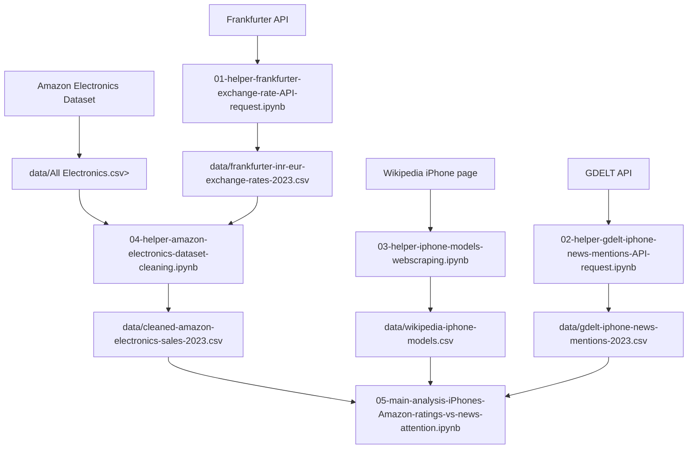

# BigDataEngineeringProject

Group: 2

Team: Elias Grünbacher, Peter Kovacs, Mario Lagger

# Data Sources

This project combines product, exchange-rate, iPhone reference, and news-attention data. All generated and input CSV files used by the notebooks are stored in `notebooks/data/`.

### 1. Amazon Electronics Sales Dataset 2023

- Source: Kaggle Amazon Products Dataset, file `All Electronics.csv`
- Link: https://www.kaggle.com/datasets/lokeshparab/amazon-products-dataset?select=All+Electronics.csv
- Local file: `notebooks/data/All Electronics.csv`
- Used in: `04-helper-amazon-electronics-dataset-cleaning.ipynb`
- Description: Raw Amazon electronics product listings. The project uses product names, categories, ratings, number of ratings, image/product links, and INR price columns. The analysis later filters this dataset to actual iPhone handset listings and excludes accessories.

### 2. Frankfurter Exchange Rate API

- Source: Frankfurter REST API
- Link: https://api.frankfurter.dev/v2/rates
- Generated file: `notebooks/data/frankfurter-inr-eur-exchange-rates-2023.csv`
- Produced by: `notebooks/01-helper-frankfurter-exchange-rate-API-request.ipynb`
- Used in: `notebooks/04-helper-amazon-electronics-dataset-cleaning.ipynb`
- Description: Historical INR to EUR exchange rates for 2023. The cleaning notebook calculates the average 2023 INR to EUR rate and uses it to convert Amazon product prices from INR to EUR.

### 3. iPhone Wikipedia Page

- Source: Wikipedia iPhone page
- Link: https://en.wikipedia.org/wiki/IPhone
- Generated file: `notebooks/data/wikipedia-iphone-models.csv`
- Produced by: `notebooks/03-helper-iphone-models-webscraping.ipynb`
- Used in: `notebooks/05-main-analysis-iPhones-Amazon-ratings-vs-news-attention.ipynb`
- Description: iPhone generation metadata scraped from the Wikipedia model table. The project uses model names, release dates, release years, and support metadata. Combined model rows are normalized into separate model names where needed.

### 4. GDELT DOC API

- Source: GDELT DOC API
- Link: https://api.gdeltproject.org/api/v2/doc/doc
- Generated file: `notebooks/data/gdelt-iphone-news-mentions-2023.csv`
- Produced by: `notebooks/02-helper-gdelt-iphone-news-mentions-API-request.ipynb`
- Used in: `notebooks/05-main-analysis-iPhones-Amazon-ratings-vs-news-attention.ipynb`
- Description: 2023 news mention counts for the fixed iPhone model list used in the analysis: `iPhone 12`, `iPhone 13`, `iPhone 14`, `iPhone 14 Plus`, `iPhone 14 Pro`, and `iPhone 14 Pro Max`. The API notebook stores the mention count, query URL, and fetch status for each model.

### 5. Cleaned Amazon Electronics Dataset

- Generated file: `notebooks/data/cleaned-amazon-electronics-sales-2023.csv`
- Produced by: `notebooks/04-helper-amazon-electronics-dataset-cleaning.ipynb`
- Used in: `notebooks/05-main-analysis-iPhones-Amazon-ratings-vs-news-attention.ipynb`
- Description: Cleaned version of the Amazon dataset after missing-value handling, duplicate removal, type conversion, INR to EUR price conversion, invalid-value filtering, and final formatting.

# Data Pipeline

1. `01-helper-frankfurter-exchange-rate-API-request.ipynb` requests 2023 INR to EUR exchange rates from Frankfurter and writes `data/frankfurter-inr-eur-exchange-rates-2023.csv`.

2. `02-helper-gdelt-iphone-news-mentions-API-request.ipynb` requests 2023 GDELT news mention counts for the selected iPhone models and writes `data/gdelt-iphone-news-mentions-2023.csv`.

3. `03-helper-iphone-models-webscraping.ipynb` scrapes iPhone model metadata from Wikipedia, normalizes model names, and writes `data/wikipedia-iphone-models.csv`.

4. `04-helper-amazon-electronics-dataset-cleaning.ipynb` reads the raw Amazon dataset from `data/All Electronics.csv` and the exchange-rate data from `data/frankfurter-inr-eur-exchange-rates-2023.csv`. It cleans the product data, converts prices to EUR, validates the result, and writes `data/cleaned-amazon-electronics-sales-2023.csv`.

5. `05-main-analysis-iPhones-Amazon-ratings-vs-news-attention.ipynb` reads:
   - `data/cleaned-amazon-electronics-sales-2023.csv`
   - `data/wikipedia-iphone-models.csv`
   - `data/gdelt-iphone-news-mentions-2023.csv`

   It filters the Amazon data to actual iPhone handset listings, joins product listings to iPhone model metadata, calculates Amazon value scores, joins GDELT news attention counts, and evaluates whether models with more news attention have worse Amazon value scores.
